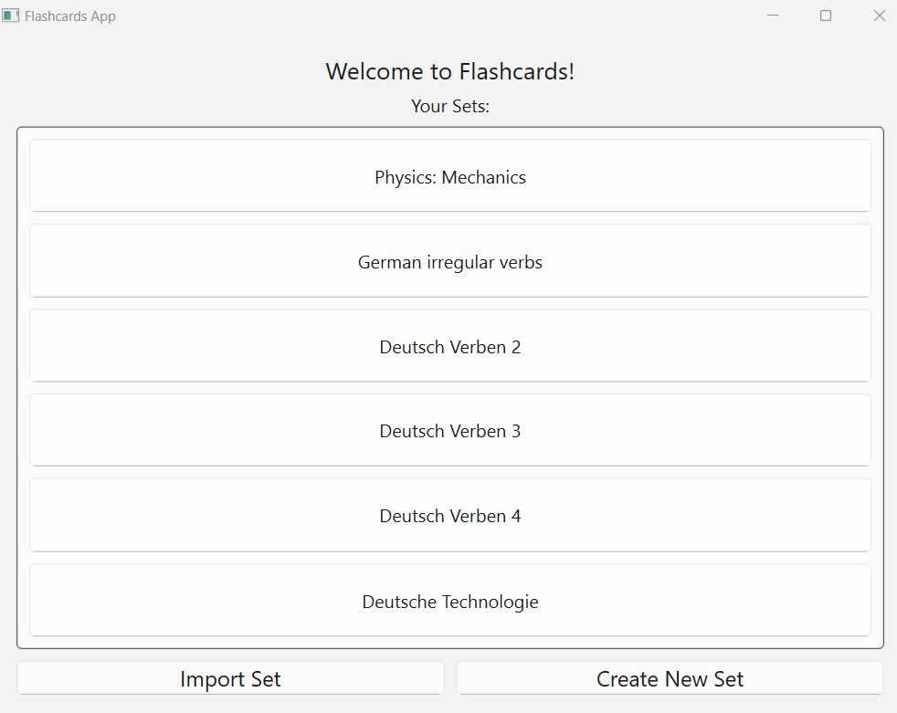
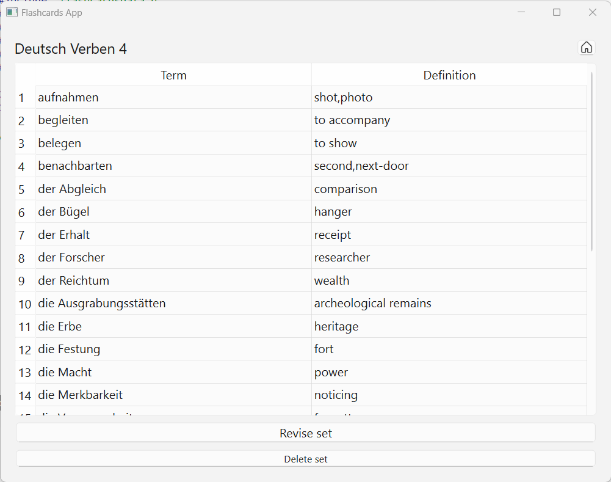
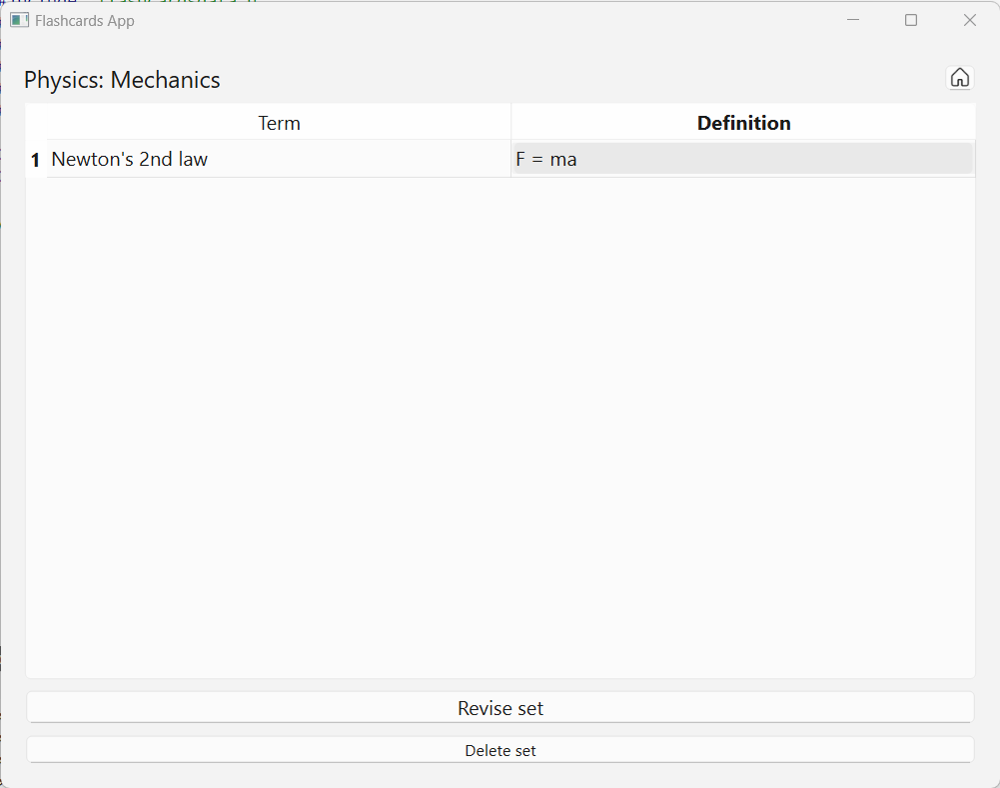
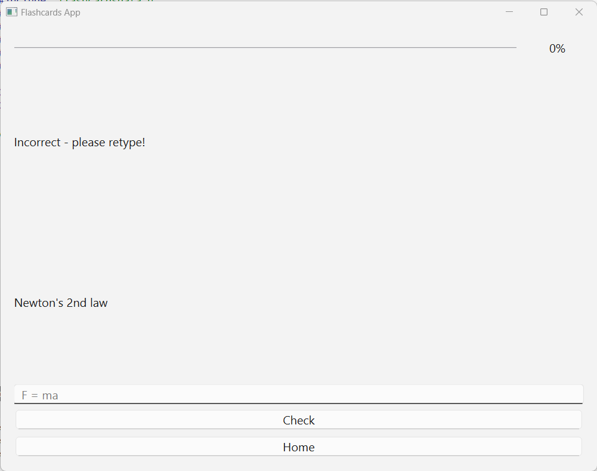
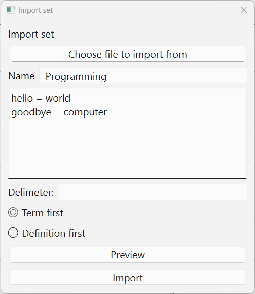
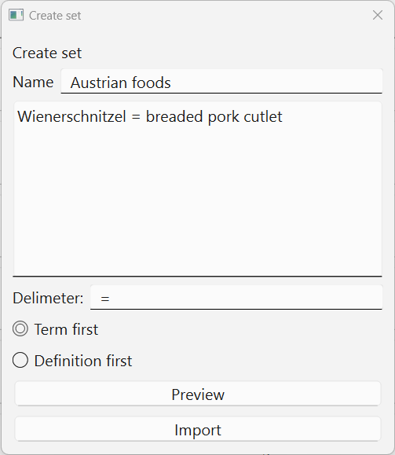
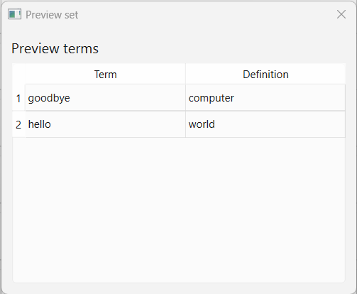

# Flashcards
Flashcards app, made using C++, CMake, and Qt 6.7.
## Screenshots
#### Home page
 
#### Set view
 
#### Editing terms of a set
 
#### Revising a set
 
#### Importing a set
 
#### Creating a set
 
#### Previewing a newly-created set
 
